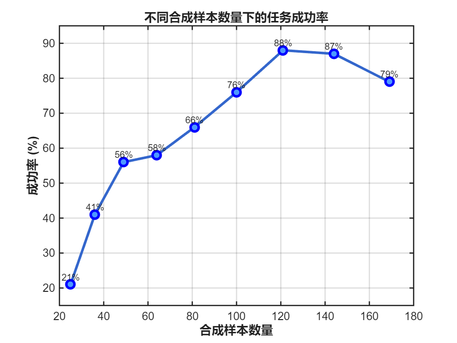
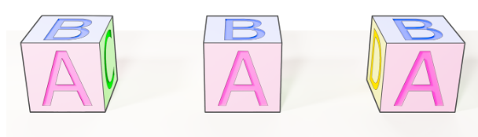
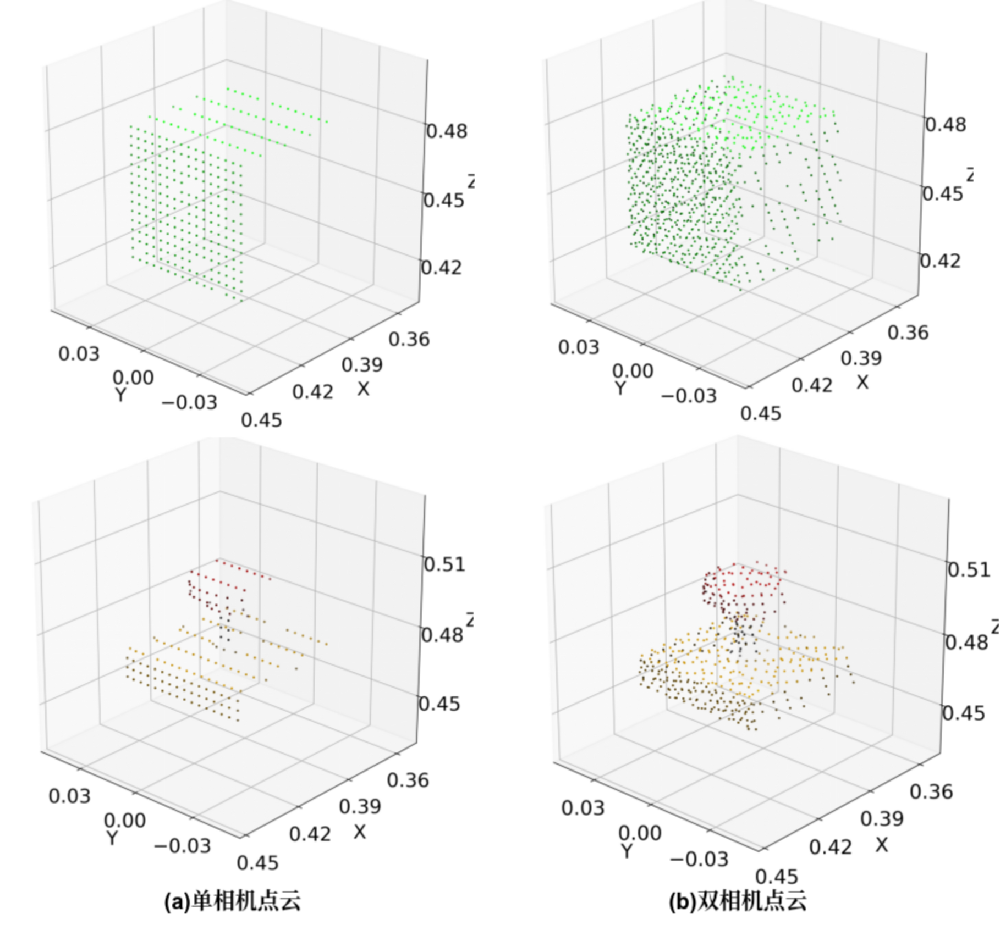
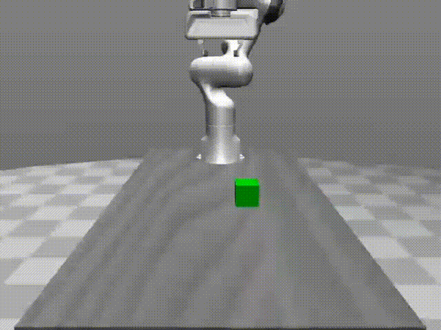
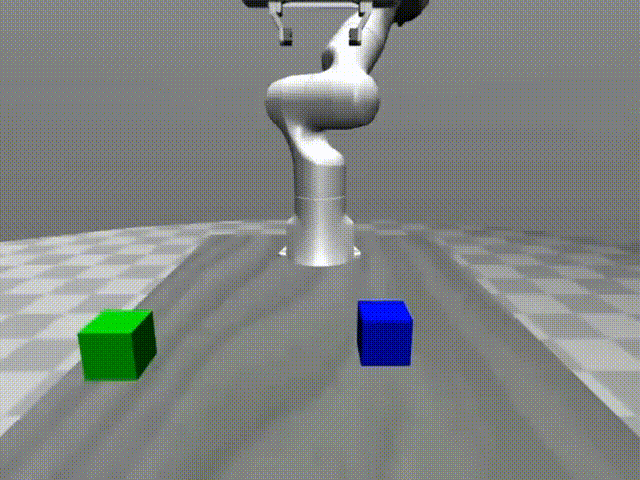
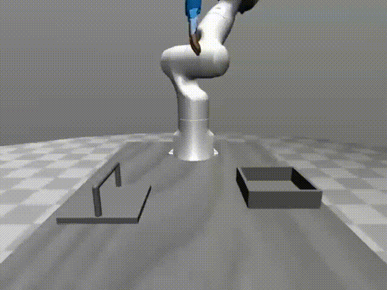
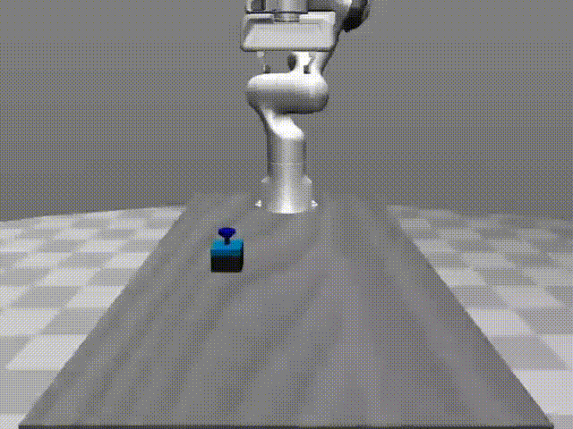
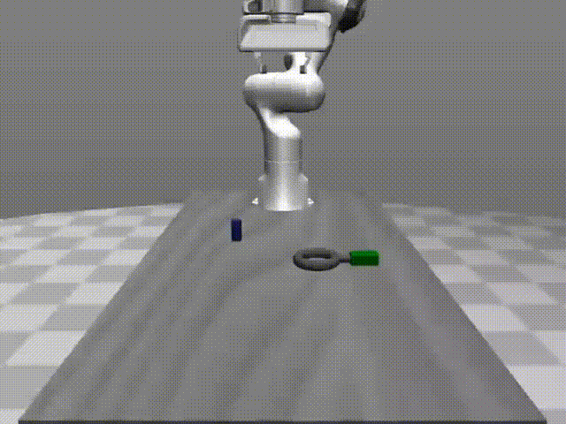
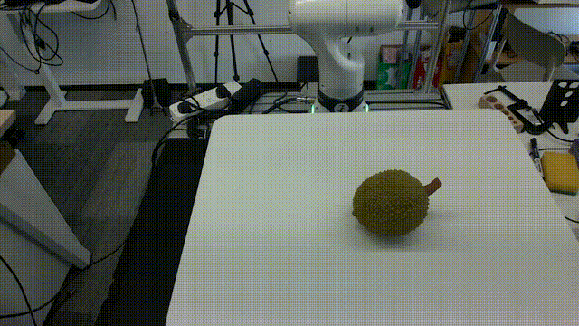
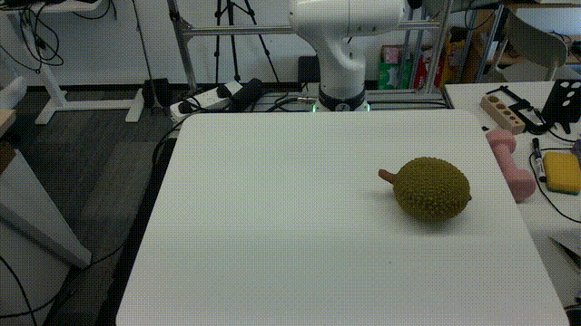

# DemoGen-Simulation/毕业设计

基于 [DemoGen](https://github.com/TEA-Lab/DemoGen) 合成演示数据生成框架与 [RoboPal](https://github.com/NoneJou072/robopal) 机器人仿真环境的视觉运动策略学习项目。仅凭单次人类遥操作演示，即可通过空间增强快速生成数百条合成演示数据，训练 3D Diffusion Policy (DP3)，并在仿真/真实环境中完成机器人操作任务。

## 项目结构

```
Demogen-simulation/
├── DemoGen-master/              # DemoGen 核心框架
│   ├── demo_generation/         # 合成演示数据生成（含任务配置）
│   ├── diffusion_policies/      # DP3 策略训练与评估（含训练配置）
│   ├── replay_eva/              # 仿真评估脚本
│   ├── data/                    # 数据目录 (source_demos, datasets, ckpts, sam_mask)
│   └── merge_zarr.py            # Pickle → Zarr 格式转换
├── robopal/                     # RoboPal 仿真环境
│   └── robopal/
│       ├── collect_data/        # 数据采集脚本（各任务）
│       ├── envs/                # 环境封装
│       ├── robots/              # 机器人定义
│       └── assets/              # 机器人模型与场景文件
├── docs/                        # 文档
│   ├── 环境配置.md
│   └── 操作流程.md
└── README.md
```

## 数据格式

本项目使用标准绝对位置格式，每帧采集数据包含：

| 字段 | 形状 | 说明 |
|------|------|------|
| `point_cloud` | (T, 1024, 6) | XYZ 坐标 + RGB 颜色 |
| `image` | (T, 3, 84, 84) | RGB 图像 (CHW 格式) |
| `depth` | (T, 84, 84) | 深度图 |
| `agent_pos` | (T, 7) | [x, y, z, qx, qy, qz, gripper] 末端当前位姿 |
| `action` | (T, 7) | [x, y, z, qx, qy, qz, gripper] 末端目标位姿 |

> 详细的环境安装与依赖配置请参阅 [环境配置](docs/环境配置.md)。
> 完整的分步操作指南请参阅 [操作流程](docs/操作流程.md)。

---

## 仿真实验

> 详细的环境安装与依赖配置请参阅 [环境配置](docs/环境配置.md)。
> 完整的分步操作指南请参阅 [操作流程](docs/操作流程.md)。

### 实验一：样本数量与泛化性能

**目的**：研究合成样本数量对策略空间泛化能力的影响。

以 Pick\_cube 单物体抓取任务为研究对象，在 MuJoCo 仿真环境中使用 FR3 机械臂 + PandaHand 夹爪，固定 0.3m × 0.3m 测试工作空间，分别构造 25、36、49、64、81、100、121、144、169 组合成样本的数据集，每组测试 100 个回合。

**成功判定**：绿色立方体被抓起高度 > 0.46m，且夹爪与立方体 X 方向对齐误差 ≤ 0.03m。

**结果**：

<!-- 图：折线图 - 合成样本数量 vs 成功率 -->


当合成样本从 25 组增加到 121 组时，成功率由 21% 提升至 88%。继续增加至 144 组（87%）和 169 组（79%）后性能不再提升，原因是视觉不匹配问题随空间范围扩大而累积。

<!-- 图：视觉不匹配示意 -->


**结论**：合成样本数量与泛化性能呈非线性关系，121–144 组样本在 Pick\_cube 任务上取得最佳平衡。

### 实验二：点云观测质量对泛化性能的影响

**目的**：比较单相机原始点云与双相机点云补全对策略空间泛化的作用。

在 Pick\_cube（0.4m × 0.4m 工作空间，225 组样本）和 Press\_button（0.3m × 0.3m，144 组样本）两个任务上开展对比：

- **单相机**：正前方视角采集，统一采样 1024 点
- **双相机补全**：左右斜前方各 512 点，融合为 1024 点

<!-- 图：单相机 vs 双相机点云对比 -->


**结果**：

| 任务 | 工作空间 | 单相机 | 双相机补全 |
|------|----------|--------|------------|
| Pick\_cube | 0.4m × 0.4m | 50% | **77%** |
| Press\_button | 0.3m × 0.3m | 64% | **99%** |

Press\_button 任务提升尤为显著（+35%），因为按钮按压对局部几何结构和接触位置精度更敏感，多视角点云补全有效缓解了遮挡和深度缺失。

**结论**：点云观测完整性是影响空间泛化的关键因素，双相机补全在高精度接触类任务上提升更大。

### 实验三：合成数据与真实数据对比

**目的**：验证单样本演示合成方法能否替代多组真实示教数据。

在 5 个桌面操作任务上比较四种数据来源：

| 任务 | 类型 | Source 10 | Source 25 | 合成 | 合成+补全 |
|------|------|-----------|-----------|------|-----------|
| Pick\_cube | 抓取 | 50% | 75% | 87% | 90% |
| Stack\_cube | 堆叠 | 44% | 95% | 67% | 79% |
| Close\_box | 开合（灵巧手） | 44% | 95% | 76% | 95% |
| Press\_button | 按压 | 54% | 90% | 64% | 99% |
| Assembly | 装配 | 47% | 83% | 78% | 80% |
| **平均** | | **47.8%** | **87.6%** | **74.4%** | **88.8%** |

**Pick\_cube**


**Stack\_cube**


**Close\_box**


**Press\_button**


**Assembly**


**结论**：单样本演示合成（74.4%）远超 10 组真实演示（47.8%）；加补全后（88.8%）略优于 25 组真实演示（87.6%）。单条源演示采集仅需 1–2 分钟，合成数百条数据仅需数秒，相比采集 25 组真实演示（数小时级）大幅降低成本。

---

## 真机验证

### 平台配置

| 组件 | 型号 |
|------|------|
| 机械臂 | FR3 (Franka Emika) |
| 末端执行器 | Linker Hand O6 灵巧手 |
| 相机 | Intel RealSense L515（固定于工作空间正上方） |
| 通信 | TCP（机械臂）+ CAN 总线（灵巧手） |

### 实验设置

单物体抓取任务：目标为放置在桌面上的榴莲形状道具。每次实验机械臂回到初始位姿，道具随机放置在工作空间内。策略未经任何真实环境微调，直接从仿真迁移部署。

### 实验结果

10 次测试中成功完成 5 次抓取（成功率 50%）。

**成功案例**：

<!-- 视频：真机成功抓取 -->


机器人从 HOME 位姿自主接近目标，基于实时点云观测调整末端姿态，灵巧手准确闭合、稳定抓取榴莲道具并成功提起。

**失败案例**：

<!-- 视频：真机失败 -->


主要失败原因：
- 末端对齐不准确，未能精确到达目标位置
- 灵巧手夹持不稳，物体在抓取过程中滑落
- 点云观测质量不足，影响策略决策精度

**结论**：基于合成数据训练的策略能够成功部署到真实机器人平台，未经真机微调即实现了端到端抓取，初步验证了单样本演示合成方法的 Sim-to-Real 迁移可行性。

---

## 致谢

本项目基于以下开源工作：

- **DemoGen**: [TEA-Lab/DemoGen](https://github.com/TEA-Lab/DemoGen) — 合成演示数据生成框架
- **RoboPal**: [NoneJou072/robopal](https://github.com/NoneJou072/robopal) — MuJoCo 机器人仿真框架
- **DP3**: 3D Diffusion Policy for visuomotor robot manipulation

## 引用

```bibtex
@article{xue2025demogen,
  title={DemoGen: Synthetic Demonstration Generation for Data-Efficient Visuomotor Policy Learning},
  author={Xue, Zhengrong and Deng, Shuying and Chen, Zhenyang and Wang, Yixuan and Yuan, Zhecheng and Xu, Huazhe},
  journal={arXiv preprint arXiv:2502.16932},
  year={2025}
}

@software{Zhou_robopal_A_Simulation_2024,
  author = {Zhou, Haoran and Huang, Yichao and Zhao, Yuhan and Lu, Yang},
  doi = {10.5281/zenodo.11078757},
  month = apr,
  title = {{robopal: A Simulation Framework based Mujoco}},
  url = {https://github.com/NoneJou072/robopal},
  version = {0.3.1},
  year = {2024}
}
```

## 许可证

- DemoGen: MIT License
- RoboPal: Apache 2.0 License
